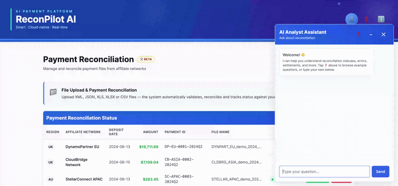

# ReconPilot AI

> AI Analyst Assistant for Affiliate Payment Reconciliation — powered by Anthropic Claude API with RAG architecture.

[](https://reconpilot-ai.up.railway.app)
[](https://reconpilot-ai.up.railway.app)
[](https://rubyonrails.org)
[](https://python.org)
[](https://docker.com)
[](https://anthropic.com)
[](https://openai.com)
[](https://github.com/rah00l/ai-reconcilation-analyst/deployments/fabulous-trust%20%2F%20production)

---

## Demo



🔗 **[View Live App →](https://reconpilot-ai.up.railway.app)**

---

## What It Does

ReconPilot is the **AI capability layer** built on top of a production affiliate payment reconciliation platform. It enables accounting and operations teams to interact with reconciliation data in natural language — replacing hours of manual report analysis with a conversational AI interface.

- **Ask questions** — *"Show discrepancies for October"* / *"Which affiliates have unmatched transactions?"*
- **Surface discrepancies** — AI reasons over reconciliation rules and flags mismatches
- **Audit-trail explanations** — plain-language summaries of why a transaction is flagged
- **Follow-up suggestions** — chatbot proactively suggests next actions based on context
- **Session continuity** — multi-turn conversation maintains context across queries

---

## Architecture

```
┌──────────────────────────────────────────────────────────────┐
│                      Railway (Cloud)                         │
│                                                              │
│  ┌──────────────────┐    ┌──────────────────────────────┐    │
│  │  Rails 7.x App   │───▶│  FastAPI AI Engine (RAG)     │    │
│  │  (Web + UI)      │    │  Python 3.11                 │    │
│  └──────────────────┘    │                              │    │
│           │              │  ┌────────────────────────┐  │    │
│  ┌────────▼──────┐       │  │ 8 Handbook Docs (55    │  │    │
│  │  PostgreSQL   │       │  │ chunks) → ChromaDB     │  │    │
│  │  (Data Store) │       │  │ vector store           │  │    │
│  └───────────────┘       │  └────────────────────────┘  │    │
│                          │  ┌────────────────────────┐  │    │
│                          │  │ OpenAI Embeddings +    │  │    │
│                          │  │ GPT-4o (grounded)      │  │    │
│                          │  └────────────────────────┘  │    │
│                          └──────────────────────────────┘    │
└──────────────────────────────────────────────────────────────┘
```

Each service is independently containerised with **Docker** and deployable separately.

> **Note:** The FastAPI AI Engine shown above is maintained in a separate repository — [reconpilot-ai-engine](https://github.com/rah00l/reconpilot-ai-engine) <!-- ⚠️ CONFIRM ACTUAL REPO NAME/URL --> — and deployed as its own Railway service. This repo (the Rails web app) calls it over HTTP. See **Related Repositories** below.

---

## AI Engine — RAG Pipeline

The AI Analyst Assistant uses **Retrieval-Augmented Generation (RAG)** to answer natural language questions about payment reconciliation. Unlike a simple chatbot, every answer is grounded in a curated knowledge base — the system retrieves the most relevant documentation before generating a response, and cites its sources.

### How it works

1. **8 handbook documents** (55 chunks) cover: file statuses, bucket classification, missing reason codes, tenancy settlement rules, reconciliation lifecycle, reconcile buttons, commission adjustments, and file upload validations
2. **Chunk enrichment** — section titles are prepended to each chunk for improved embedding quality
3. **OpenAI `text-embedding-3-small`** generates 1536-dimension vectors for each chunk
4. **ChromaDB** stores vectors with cosine similarity indexing
5. At query time: question is embedded → top-3 chunks retrieved by semantic similarity → grounded prompt assembled → GPT-4o generates a cited answer
6. **Confidence gate** — if the best retrieval distance exceeds 0.7, the system refuses to answer rather than hallucinating

### Key design decisions

- **RAG is used for prose documentation, not transactional data.** We investigated real production CSVs across four separate batches and confirmed that all transactional fields are closed enums, numeric facts, or deterministic strings — SQL/tool-calling is the correct approach there, not RAG.
- **Raw SDK implementation over LangChain** — direct OpenAI + ChromaDB calls for full pipeline transparency. LangChain refactor is a planned future enhancement.
- **No reranking** — at 55 chunks, the corpus is smaller than a typical rerank candidate pool. The technique solves a problem that structurally cannot occur at this scale.
- **Document-structure-aware chunking** — since we author the docs ourselves, chunk boundaries are designed at authoring time (one concept per `##` section), not computed algorithmically.

### Evaluation results

| Metric | Result |
|--------|--------|
| Test questions | 10 paraphrased queries |
| Retrieval accuracy (correct top-1) | 10/10 |
| Best retrieval distance | 0.20 (direct match with enrichment) |
| Paraphrased question avg distance | 0.40–0.55 |
| False refusals | 0/10 |
| Off-topic rejection (confidence gate) | Working — verified on 4 test cases |

---

## Tech Stack

| Layer | Technology |
|---|---|
| Web Application | Ruby on Rails 7.2, PostgreSQL, Tailwind CSS |
| AI Engine | Python 3.11, FastAPI, OpenAI GPT-4o |
| RAG Pipeline | ChromaDB (vector store), OpenAI `text-embedding-3-small` |
| LLM | Anthropic Claude API |
| Containerisation | Docker (multi-service) |
| Deployment | Railway |
| Evaluation | Automated 10-question retrieval harness |

---

## Related Repositories

This project is split across two independently deployed repositories:

| Repository | Description |
|---|---|
| **ai-reconcilation-analyst** (this repo) | Rails 7.2 web application — UI, payment file upload/validation, reconciliation views, chat widget frontend |
| **[reconpilot-ai-engine](https://github.com/rah00l/reconpilot-ai-engine)** <!-- ⚠️ CONFIRM ACTUAL REPO NAME/URL --> | Python/FastAPI RAG reasoning engine — chunking, embeddings, ChromaDB retrieval, grounded generation, eval harness |

Both services are deployed independently on Railway within the same project and communicate over HTTP. This separation was intentional — it let Phase 2 AI development happen on a dedicated branch/repo without risking the live, already-deployed Sinatra-based reconciliation service.

---

## Phase 2 — Completed

Phase 2 replaced the original rule-based Sinatra engine with a RAG-powered FastAPI engine:

| Milestone | Description | Status |
|-----------|------------|--------|
| 2A | FastAPI scaffold with health/info/ready/analyze endpoints | ✅ Complete |
| 2B | RAG pipeline — 8 docs, 55 chunks, ChromaDB, grounded prompts, source citations | ✅ Complete |
| 2C | Automated eval harness (10/10), confidence gate fallback (0.7 threshold) | ✅ Complete |
| 2D | Rails integration, engine swap, production deployment | ✅ Complete |

---

## Roadmap

- [x] **Phase 1** — Rule-based reconciliation engine (live)
- [x] **Phase 1** — Anthropic Claude API chatbot with session continuity
- [x] **Phase 1** — Multi-service Docker architecture deployed on Railway
- [x] **Phase 2** — Rule-based engine upgraded to RAG-powered AI assistant
- [x] **Phase 2** — ChromaDB vector store + OpenAI embeddings for semantic search over reconciliation handbook docs
- [x] **Phase 2** — Automated eval harness with grounded, source-cited answers and confidence-gate fallback
- [ ] **Phase 3** — Query routing (RAG vs SQL vs rule-based, automatic)
- [ ] **Phase 3** — Transaction-level lookups via tool-calling
- [ ] **Phase 3** — LangChain refactor for pipeline orchestration
- [ ] **Phase 3** — pgvector migration (ChromaDB → PostgreSQL)
- [ ] **Phase 3** — Role-based access for accounting vs operations teams

---

## Background

ReconPilot is the AI extension of a production reconciliation platform built during the **Intelliswift / Incentive Networks (Tenerity)** engagement. The domain expertise — reconciliation rules, transaction matching, affiliate payment flows — was developed over 3+ years of production work and forms the knowledge base for AI-assisted reasoning in this system.

---

## Local Setup

```bash
# Clone the repo
git clone https://github.com/rah00l/ai-reconcilation-analyst.git
cd ai-reconcilation-analyst

# Copy environment variables
cp .env.example .env
# Add your ANTHROPIC_API_KEY to .env

# Start all services with Docker
docker-compose up --build

# App runs at http://localhost:3000
```

> Requires Docker and a valid `ANTHROPIC_API_KEY` in your `.env` file.
>
> **Note:** This repo alone runs the web app and reconciliation features. For full AI Analyst Assistant functionality, also clone and run **[reconpilot-ai-engine](https://github.com/rah00l/ai-analyst-engine/tree/phase2/integration)** <!-- ⚠️ CONFIRM ACTUAL REPO NAME/URL --> — see that repo's README for its own setup steps.

---

## Author

**Rahul Patil** — Senior Software Engineer / AI Engineer
[LinkedIn](https://linkedin.com/in/rahulpatil2387) · [GitHub](https://github.com/rah00l) · [Blog](https://rah00l.github.io)
